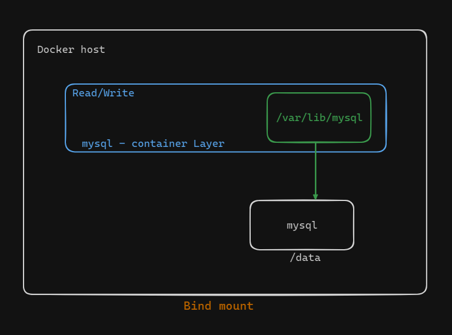
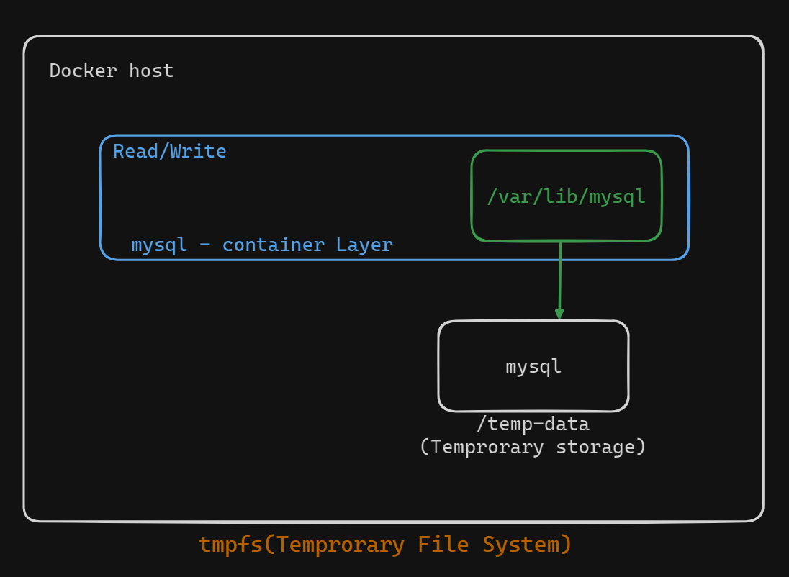

# Docker Storage Solutions: Understanding Volumes, Bind Mounts, and tmpfs


Efficient storage solutions are crucial for containerized applications to ensure data persistence and security. Here, we will explore the different storage solutions provided by Docker: Volumes, Bind Mounts, and tmpfs.

### Why Backup Container Data?

Containers have two types of layers:

1. **Read-Only Layers**: Permanent data, never modified due to the Copy-on-Write policy.
2. **Read/Write Layers**: Temporary or volatile data, lost when the container stops or dies.

**Key Question**: What data needs to be backed up?

- **Answer**: Important data from the volatile Read/Write layer.

### Where to Store the Data?

Data can be stored:

- On the same machine hosting Docker
- On another server
- On the Cloud

### Types of Docker Storage Objects

1. **Volumes**
2. **Bind Mounts**
3. **tmpfs (Temporary File System)**

## 1. Volumes


**Explanation**:

- Volumes are storage objects completely isolated from the host filesystem.
- Managed by Docker commands.
- Secure and reliable for operations.
- Data is stored in dedicated directories on the host but controlled by Docker.

**Key Points**:

- Containers know only the volume name, not the path on the host.
- Ensures integrity and security of data.


For the above example we have to use the following command:

```bash
docker volume create data_volume
docker run -v data_volume:/var/lib/mysql mysql
```

## 2. Bind Mounts


**Explanation**:

- Allows the use of any directory on the Docker host for storage.
- Convenient but exposes storage locations, affecting security.
- Users may not have privileges to create or access the specified paths.


**Key Points**:

- Exposes storage paths, impacting security.
- May cause issues with path availability and privileges.



For the above example we have to use the following command:

```bash
docker run -v /data/mysql:/var/lib/mysql mysql
```
or,
```bash
docker --mount source=/data/mysql target=/var/lib/mysql mysql
```

## 3. tmpfs (Temporary File System)

**Explanation**:

- tmpfs mounts allow the creation of files outside the container's writable layer.
- Temporary, only persists in host memory, not in storage.
- Ideal for storing sensitive files that should not persist after the container stops.


**Key Points**:

- Data is not persisted after the container stops.
- Useful for sensitive or temporary data.
- Limited to Linux environments.




## Conclusion

Understanding the different Docker storage solutions—Volumes, Bind Mounts, and tmpfs—helps in choosing the right storage strategy based on the application needs and security requirements. Volumes are the most secure and reliable, Bind Mounts offer flexibility but with potential security risks, and tmpfs is suitable for temporary and sensitive data storage.

By implementing these storage solutions effectively, you can ensure data persistence and security, reducing the risk of data loss and potential job-related issues.

### Summary Diagram

```
+-------------------+-------------------+-------------------+
|                 Docker Storage Solutions                  |
+-------------------+-------------------+-------------------+
|      Volumes      |    Bind Mounts    |       tmpfs       |
+-------------------+-------------------+-------------------+
| 1. Isolated from  | 1. Any directory  | 1. Host memory    |
|    host FS        |    on host        |                   |
|                   |                   |                   |
| 2. Secure         | 2. Flexible       | 2. Temp data      |
|                   |                   |                   |
| 3. Persistent     | 3. Less Secure    |                   |
+-------------------+-------------------+-------------------+


```

By following these guidelines and understanding the diagrams, you can effectively manage Docker storage for your containerized applications.